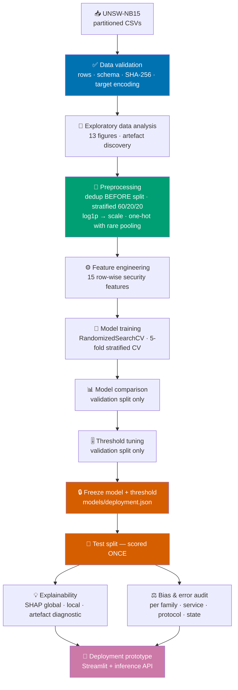

# 🛡️ Machine Learning-Based Network Intrusion Detection and Anomaly Classification

> Flow-level intrusion detection on UNSW-NB15 — built to be reproducible,
> explainable, and honest about what it actually measures.


*Generated 2026-09-16. Every metric on this page is read from
`reports/metrics/`, written by executed code.*

---

## 📋 Table of contents

1. [Executive summary](#-executive-summary)
2. [Problem statement](#-problem-statement)
3. [Dataset](#-dataset)
4. [Architecture and workflow](#-architecture-and-workflow)
5. [Installation](#-installation)
6. [Usage](#-usage)
7. [Model comparison](#-model-comparison)
8. [Main findings](#-main-findings)
9. [Explainability](#-explainability)
10. [Limitations](#-limitations)
11. [Repository structure](#-repository-structure)
12. [Deployment](#-deployment)
13. [Ethical AI and bias](#-ethical-ai-and-bias)
14. [Reproducibility](#-reproducibility)
15. [References](#-references)

---

## 🎯 Executive summary

Security Operations Centres receive tens of millions of network flow records a
day and can manually review almost none of them. This project builds a
supervised detector that scores every flow for maliciousness using **flow
statistics only** — no packet payloads, no IP addresses, no port numbers, no
timestamps — and ranks them for analyst triage.

**XGBoost** detects **91.1%** of attacks on 30,737 held-out flows while alerting on **7.14%** of benign traffic (F1 0.9109, PR-AUC 0.9791).

| Metric | Value |
|---|---|
| **Model** | XGBoost |
| **Operating threshold** | 0.505 (tuned on validation) |
| **Attack recall** | **91.12%** |
| **Precision** | 91.06% |
| **F1** | **0.9109** |
| **ROC-AUC** | 0.9824 |
| **PR-AUC** | 0.9791 |
| **False-negative rate** | 8.88% (1,212 attacks missed) |
| **False-positive rate** | 7.142% (1,221 false alerts) |
| **Throughput** | 195,353 flows/second |
| **Test-set size** | 30,737 unseen flows |

**But the headline numbers are not the contribution.** Three findings from this
project change how the result should be read:

| Finding | Why it matters |
|---|---|
| **40.4% of UNSW-NB15 is duplicated**, and duplication is class-correlated (Generic 87.6%, Normal 8.1%) | Benchmarks that split randomly without deduplicating score models partly on rows they memorised. This project deduplicates **before** splitting and measures the difference. |
| **A capture artefact inflates performance.** The testbed ran benign and attack generators on hosts with different initial TTL values, and SHAP attributes 54% of total decision impact to the TTL family | `sttl` partly encodes *which generator* produced a flow, not whether it is hostile. A dedicated ablation retrains without it. |
| **Detection quality is not uniform across attack families** | Aggregate recall conceals substantially weaker performance on stealthy, low-volume families — precisely the ones a defender most wants caught. |

**Recommendation:** deploy as a **human-in-the-loop triage ranking layer**, not
as an autonomous blocking control.

---

## 🔍 Problem statement

**Task:** supervised binary classification of network flow records.
**Target:** `label` — 0 = benign, 1 = malicious.
**Constraint:** flow-level features only.

> **Research question.** Can supervised machine-learning models accurately
> distinguish malicious from benign network traffic while maintaining an
> operationally acceptable false-negative and false-positive rate?

The two failure modes are asymmetric but both real:

- **Missed detections** let an intrusion proceed. Dwell time is the variable most
  strongly associated with breach cost.
- **False positives** flood the alert queue. A detector alerting on 1% of benign
  traffic across 10M daily flows produces 100,000 alerts a day; a team that
  cannot work its queue stops trusting it, and real detections get closed unread.

Seven technical targets (T1–T7) and seven methodological criteria (M1–M7) were
**pre-registered before modelling** in
[`reports/problem_statement.md`](reports/problem_statement.md).

---

## 📊 Dataset

**[UNSW-NB15](https://research.unsw.edu.au/projects/unsw-nb15-dataset)** —
Australian Centre for Cyber Security, UNSW Canberra (Moustafa & Slay, 2015).
Synthetic traffic generated on a 2015 testbed with IXIA PerfectStorm, captured
with `tcpdump`, and converted to flow records with Argus and Bro/Zeek.

| Property | Value |
|---|---|
| Published records | 257,673 (175,341 train + 82,332 test) |
| Columns | 45 |
| Attack families | 10 (Normal + 9 attack types) |
| Missing values | **0** |
| Duplicate predictor vectors | 103,989 (40.4%) |
| Records after deduplication | **153,684** |
| Class balance (published) | 36.1% benign / 63.9% attack |
| Class balance (deduplicated) | 55.6% benign / 44.4% attack |

### Acquiring it

`python -m src.data_loader` downloads both partitions and **verifies them
independently** — row counts, column count, target encoding, the
`label`/`attack_cat` consistency rule, and SHA-256. If every mirror is
unreachable it prints exact manual-download instructions.

The dataset is **not committed** to this repository. See
[`reports/dataset_documentation.md`](reports/dataset_documentation.md) for full
provenance, a per-column data dictionary and four documented data-quality
defects.

> ⚠️ **`attack_cat` is never used as a predictor.** `attack_cat == "Normal"` if
> and only if `label == 0` (verified at 1.0000 agreement across all
> 257,673 records), so using it would be target leakage.
> It is retained outside the feature matrix for stratification, subgroup
> auditing and error analysis.

---

## 🏗️ Architecture and workflow



**The ordering is the methodology.** Steps G and H use the validation split
only. Step I freezes both choices. Step J opens the test split once and changes
nothing. That is what makes the reported test metrics an estimate of
generalisation rather than a number that was optimised toward.

---

## 💾 Installation

### Option A — venv + pip

```bash
git clone <repository-url>
cd AI_Capstone_Network_Intrusion_Detection

python -m venv .venv
# Windows:
.venv\Scripts\activate
# macOS / Linux:
source .venv/bin/activate

pip install --upgrade pip
pip install -r requirements.txt
```

### Option B — conda

```bash
conda env create -f environment.yml
conda activate nids-capstone
```

**Requirements:** Python 3.11–3.13, ~2 GB RAM for the full corpus, ~500 MB disk.
No GPU required.

---

## ▶️ Usage

### Run everything

```bash
python -m src.data_loader     # download + verify the dataset
python -m src.pipeline --all  # EDA, training, evaluation, ablations, reports
```

### Run stages individually

```bash
python -m src.data_loader          # acquire and verify UNSW-NB15
python -m src.document             # dataset documentation + data dictionary
python -m src.eda                  # 13 EDA figures + statistics
python -m src.preprocessing        # materialise train/val/test splits
python -m src.train                # tune and fit all models
python -m src.pipeline --evaluate  # evaluate, tune threshold, SHAP, audit
python -m src.pipeline --ablations # all ablation experiments
python -m src.report               # regenerate every written report
```

### Ablation experiments

```bash
python -m src.train --list-ablations
python -m src.train --ablation no_ttl
python -m src.train --ablation keep_duplicates
```

### Score new flows

```bash
python -m src.predict --demo
python -m src.predict --input flows.csv --output scored.csv
```

### Launch the demo application

```bash
streamlit run app/streamlit_app.py
```

### Notebooks

```bash
jupyter lab notebooks/
```

`01_problem_data_understanding` → `02_eda` → `03_preprocessing_feature_engineering`
→ `04_model_training` → `05_model_evaluation` → `06_explainability_bias_audit`.

### Tests

```bash
pytest -q                          # full suite
pytest tests/test_preprocessing.py # leakage controls specifically
```

---

## 🏆 Model comparison

Held-out test split, at each model's operating threshold:

| Model | Accuracy | Precision | Recall | F1 | ROC-AUC | PR-AUC | FPR | FNR | Throughput |
|---|---|---|---|---|---|---|---|---|---|
| Logistic Regression | 0.8669 | 0.8106 | 0.9134 | 0.8590 | 0.9556 | 0.9415 | 17.028% | 8.657% | 193,909/s |
| Random Forest | 0.9172 | 0.9010 | 0.9137 | 0.9073 | 0.9811 | 0.9773 | 8.008% | 8.628% | 131,445/s |
| XGBoost | 0.9208 | 0.9106 | 0.9112 | 0.9109 | 0.9824 | 0.9791 | 7.142% | 8.884% | 195,353/s |
| LightGBM | 0.9209 | 0.9089 | 0.9134 | 0.9112 | 0.9825 | 0.9791 | 7.306% | 8.657% | 107,835/s |
| Isolation Forest | 0.6061 | 0.6719 | 0.2199 | 0.3314 | 0.6707 | 0.5912 | 8.570% | 78.009% | 65,303/s |

**Selection criterion: validation PR-AUC — deliberately not accuracy.** On a
corpus where attacks are ~44% of records, accuracy compresses every model into a
narrow band and rewards majority-class performance. PR-AUC measures ranking
quality on the positive class, which is what survives a change of base rate.

**Isolation Forest** is trained on benign flows only, without attack labels. It
is not a deployment candidate — its score is a ranking, not a probability — but
it quantifies what supervised labelling actually buys.

Full analysis:
[`reports/Model_Evaluation_Report.md`](reports/Model_Evaluation_Report.md).

---

## 🔑 Main findings

### 1. Duplication inflates published benchmarks

40.4% of UNSW-NB15 repeats an earlier feature
vector, and duplication is strongly class-dependent. A random split places
byte-identical records on both sides. This project deduplicates before splitting;
the `keep_duplicates` ablation measures the optimism that decision removes.

### 2. A capture artefact does much of the work

A lookup rule on `sttl` alone reaches 81.3% accuracy against a 55.6% majority-class baseline.
SHAP attributes **54% of total decision impact** to the TTL feature family.
The features were **kept** — they are real fields a sensor observes, and deleting
genuine signal on suspicion is its own error — but their contribution is measured
rather than assumed.

### 3. Ablations separate "detects attacks" from "detects this dataset"

| Experiment | Recall | F1 | PR-AUC |
|---|---|---|---|
| Primary protocol (headline) | 0.9112 | 0.9109 | 0.9791 |
| Duplicates retained | 0.9630 | 0.9607 | 0.9957 |
| TTL features removed | 0.9075 | 0.9111 | 0.9789 |
| Engineered features removed | 0.9158 | 0.9118 | 0.9794 |
| SMOTE instead of class weights | 0.9124 | 0.9103 | 0.9789 |
| Authors' published split | 0.9868 | 0.8881 | 0.9885 |

### 4. Engineered features add real signal

15 row-wise features, each computable by a sensor on a
single flow:

| Feature | Security rationale |
|---|---|
| `flow_bytes_total` | Total bytes carried in both directions. |
| `flow_pkts_total` | Total packets in both directions. |
| `bytes_per_packet` | Mean payload size across the whole flow. |
| `src_byte_ratio` | Share of flow bytes sent by the source, in [0, 1]. |
| `src_pkt_ratio` | Packet-count analogue of src_byte_ratio, in [0, 1]. |
| `load_log_ratio` | log1p(source bits/s) - log1p(destination bits/s). |
| `jit_log_ratio` | log1p(source jitter) - log1p(destination jitter). |
| `is_one_way` | 1 when the destination returned no packets at all. |
| `tcp_handshake_complete` | 1 when both SYN-ACK and ACK-data round-trip times are non-zero, i. |
| `tcp_seq_exchanged` | 1 when TCP base sequence numbers were observed in both directions, confirming a genuinely established bidirectional TCP session rather than a synthetic or aborted one. |
| `both_win_advertised` | 1 when both endpoints advertised a non-zero TCP receive window. |
| `is_zero_duration` | 1 when the flow's measured duration is exactly zero - a single-packet or sub-resolution event. |
| `service_unknown` | 1 when the flow analyser could not identify an application-layer service. |
| `src_loss_rate` | Fraction of source packets that were retransmitted or lost, in [0, 1]. |
| `dst_loss_rate` | Fraction of destination packets retransmitted or lost, in [0, 1]. |

### 5. Outliers are the signal, not noise

Thousands of points lie beyond the whiskers on every volume feature — 14 MB
transfers, 5.99 Gbit/s loads, 10,646-packet bursts. They are genuine attacks.
**No outlier is removed anywhere in this project.** Heavy tails are handled with
`log1p`, not deletion.

---

## 💡 Explainability

SHAP (TreeExplainer) is treated as a core deliverable, not an add-on.

| # | Feature | Mean \|SHAP\| | Share of impact |
|---|---|---|---|
| 1 | `sttl` | 4.6889 | 48.0% |
| 2 | `ct_dst_src_ltm` | 0.6891 | 7.1% |
| 3 | `ct_state_ttl` | 0.5415 | 5.5% |
| 4 | `dbytes` | 0.4650 | 4.8% |
| 5 | `service_dns` | 0.3177 | 3.3% |
| 6 | `sbytes` | 0.2302 | 2.4% |
| 7 | `dmean` | 0.1772 | 1.8% |
| 8 | `smean` | 0.1606 | 1.6% |

**What makes traffic look malicious:** high source TTL, an unanswered connection
(no destination packets, no completed handshake), strongly asymmetric direction,
elevated recent-connection counters.

**What makes traffic look benign:** a completed TCP handshake with sequence
numbers exchanged both ways, balanced bidirectional volume, an identified
application service.

**Is a proxy feature dominating?** Yes — and it is named rather than hidden. See
`figures/fig24_shap_artifact_check.png`.

Local explanations for a true positive, true negative, false positive and false
negative are in `figures/fig23_shap_local_cases.png`, each chosen as the
median-scoring member of its outcome class. The Streamlit app produces the same
explanation for any flow you supply.

---

## ⚠️ Limitations

1. **Synthetic 2015 data** — conclusions concern method, not current threat coverage.
2. **TTL capture artefact** — quantified, not eliminated.
3. **Inverted class balance** — attacks are the majority here; **precision will not transfer** to a production base rate. Recall and FPR will.
4. **No timestamps** — concept drift **cannot be measured**, only reasoned about.
5. **No IPs or ports** — no entity-level analysis, no host-grouped splitting.
6. **Uneven per-family recall** — stealthy families are systematically weaker.
7. **Adversarial adaptation untested** — flow statistics are manipulable by design.
8. **Binary scope** — multiclass family classification is supported by the data but out of scope.
9. **Single dataset** — no cross-dataset validation, so external validity is unverified.
10. **Irreducible label noise** — 414 feature vectors carry contradictory labels.

---

## 📁 Repository structure

```
AI_Capstone_Network_Intrusion_Detection/
├── README.md                    ← this file (generated from metrics)
├── requirements.txt             ← pip dependencies (version ranges)
├── requirements-lock.txt        ← exact versions that produced these results
├── environment.yml              ← conda environment
├── pytest.ini
├── .gitignore
├── .gitattributes
├── LICENSE                      ← MIT + third-party data notice
│
├── .github/workflows/
│   └── tests.yml                ← CI: import check + test suite on 3.11 / 3.13
│
├── data/
│   ├── raw/                     ← UNSW-NB15 CSVs (downloaded, not committed)
│   ├── interim/
│   └── processed/               ← materialised train/val/test splits
│
├── notebooks/
│   ├── 01_problem_data_understanding.ipynb
│   ├── 02_eda.ipynb
│   ├── 03_preprocessing_feature_engineering.ipynb
│   ├── 04_model_training.ipynb
│   ├── 05_model_evaluation.ipynb
│   └── 06_explainability_bias_audit.ipynb
│
├── src/
│   ├── config.py                ← paths, seeds, column roles, leakage exclusions
│   ├── data_loader.py           ← download, verify, load
│   ├── preprocessing.py         ← splitting + leak-free pipeline
│   ├── features.py              ← 15 engineered security features
│   ├── train.py                 ← model registry, tuning, persistence
│   ├── evaluate.py              ← metrics, curves, threshold, subgroup audit
│   ├── explain.py               ← SHAP global / local / artefact diagnostic
│   ├── predict.py               ← inference API (app + tests use this)
│   ├── pipeline.py              ← end-to-end orchestration
│   ├── eda.py                   ← all EDA figures
│   ├── document.py              ← dataset documentation + data dictionary
│   ├── plotting.py              ← shared figure styling
│   ├── make_notebooks.py        ← generates and executes the six notebooks
│   ├── deliverables.py          ← .docx / .pptx submission bundle
│   └── report*.py               ← generated reports and decks
│
├── models/                      ← fitted pipelines + deployment.json
├── figures/                     ← all publication-quality figures
├── reports/
│   ├── problem_statement.md
│   ├── dataset_documentation.md
│   ├── data_dictionary.csv
│   ├── EDA_Feature_Engineering_Report.md
│   ├── Model_Evaluation_Report.md
│   ├── Bias_Fairness_Analysis.md
│   ├── Final_Project_Report.md
│   ├── Generative_AI_Usage.md
│   ├── Rubric_Audit.md
│   ├── environment_versions.txt
│   └── metrics/                 ← machine-readable results (CSV + JSON)
│
├── presentations/
│   ├── technical_presentation_content.md
│   └── executive_presentation_content.md
│
├── deliverables/                ← submission bundle (.docx / .pptx) + demo script
│
├── app/
│   ├── streamlit_app.py
│   └── example_flows.csv        ← 120 real test-split flows for the batch tab
│
└── tests/
    ├── conftest.py
    ├── test_preprocessing.py    ← leakage controls
    ├── test_features.py         ← numerical safety, row-wise independence
    └── test_prediction.py       ← inference API
```

---

## 🚀 Deployment

### Recommended operating model

```
Flow collector → feature extraction → model → risk-banded queue → analyst → response
```

The model **ranks and explains**. Humans decide. Risk bands map probability to
action: Critical (≥0.90) → escalate immediately; High (≥0.70) → priority triage;
Medium (≥0.40) → batch review; Low → retain for hunting.

### Serving

```python
from src import predict

model = predict.load_model()          # reads models/deployment.json
scored = predict.predict(flows_df)    # probability, verdict, risk band, action
why = predict.explain_one(one_flow)   # per-alert SHAP contributions
```

The persisted artefact is a complete `Pipeline` — feature engineering,
preprocessing and estimator travel together — which removes the most common
cause of training/serving skew.

### Before production use

| Requirement | Why |
|---|---|
| Recalibrate thresholds on target-network traffic | The base rate here is not the deployment base rate |
| Per-service thresholds | A uniform threshold spends the alert budget unevenly |
| Shadow-mode evaluation first | Measure real-world FPR before anyone acts on an alert |
| Drift monitoring | Traffic is non-stationary |
| Scheduled retraining with analyst feedback as labels | The only source of in-domain labels |
| Adversarial testing against SHAP-identified features | The opponent adapts |
| Defence in depth | One layer among signatures, EDR and authentication telemetry |

> ⚠️ **This is an educational and research prototype.** It must not be used as a
> standalone production intrusion-detection system.

---

## ⚖️ Ethical AI and bias

**UNSW-NB15 contains no demographic attributes and no human subjects.** It is
synthetic machine-generated traffic with all IP addresses, ports and timestamps
removed. **No demographic fairness claim is made, because the data to support one
does not exist.**

What is performed instead is an **operational performance audit** across attack
family, application service, transport protocol and connection state — measuring
whether detection quality is uniform across the strata that genuinely exist.

Key findings: recall varies substantially by attack family; false alerts
concentrate in specific services; representation bias means precision will not
transfer; temporal bias exists but **cannot be measured** here.

Deployment-time fairness risks *are* identified separately — uneven per-service
false-positive rates mean uneven scrutiny of the humans behind those services,
and automation bias makes analysts more likely to confirm a confident score than
to challenge it.

Full analysis:
[`reports/Bias_Fairness_Analysis.md`](reports/Bias_Fairness_Analysis.md).
AI-assistance disclosure:
[`reports/Generative_AI_Usage.md`](reports/Generative_AI_Usage.md).

---

## 🔁 Reproducibility

| Control | Implementation |
|---|---|
| Global seed | `random_state = 42` in `src/config.py`, used everywhere |
| Dataset integrity | Row counts, schema, target encoding and SHA-256 verified on load |
| Environment | `requirements.txt`, `environment.yml`, `reports/environment_versions.txt` |
| Paths | All derived from the repo root via `pathlib` — no absolute paths anywhere |
| Split protocol | Stratified 60/20/20 on `attack_cat`, materialised to `data/processed/` |
| Leakage prevention | Single enforcement point (`split_xy`); verified by tests |
| Results provenance | Every number written to `reports/metrics/`; reports generated from it |
| Tuning record | `models/best_params_main.json` + `models/manifest_main.json` |

Full reproduction from a clean checkout:

```bash
pip install -r requirements.txt
python -m src.data_loader
python -m src.pipeline --all
pytest -q
```

Deleting `reports/*.md` and re-running `python -m src.report` regenerates every
written report from the same measurements.

---

## 📚 References

1. Moustafa, N. & Slay, J. (2015). *UNSW-NB15: a comprehensive data set for network intrusion detection systems.* MilCIS 2015, IEEE.
2. Moustafa, N. & Slay, J. (2016). *The evaluation of Network Anomaly Detection Systems.* Information Security Journal, 25(1–3), 18–31.
3. Axelsson, S. (2000). *The base-rate fallacy and the difficulty of intrusion detection.* ACM TISSEC, 3(3), 186–205.
4. Sommer, R. & Paxson, V. (2010). *Outside the Closed World: On Using Machine Learning for Network Intrusion Detection.* IEEE S&P, 305–316.
5. Chen, T. & Guestrin, C. (2016). *XGBoost: A Scalable Tree Boosting System.* KDD '16, 785–794.
6. Ke, G. et al. (2017). *LightGBM: A Highly Efficient Gradient Boosting Decision Tree.* NeurIPS 30.
7. Breiman, L. (2001). *Random Forests.* Machine Learning, 45(1), 5–32.
8. Liu, F. T., Ting, K. M. & Zhou, Z.-H. (2008). *Isolation Forest.* ICDM 2008, 413–422.
9. Lundberg, S. M. & Lee, S.-I. (2017). *A Unified Approach to Interpreting Model Predictions.* NeurIPS 30.
10. Lundberg, S. M. et al. (2020). *From local explanations to global understanding with explainable AI for trees.* Nature Machine Intelligence, 2(1), 56–67.
11. Saito, T. & Rehmsmeier, M. (2015). *The Precision-Recall Plot Is More Informative than the ROC Plot.* PLoS ONE, 10(3), e0118432.
12. Chawla, N. V. et al. (2002). *SMOTE: Synthetic Minority Over-sampling Technique.* JAIR, 16, 321–357.
13. Pedregosa, F. et al. (2011). *Scikit-learn: Machine Learning in Python.* JMLR, 12, 2825–2830.

---

## 📄 Licence

MIT — see [`LICENSE`](LICENSE). The licence covers the code and documentation in
this repository only; the UNSW-NB15 dataset remains subject to its authors'
terms and must be cited independently.
