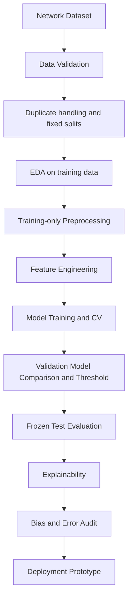
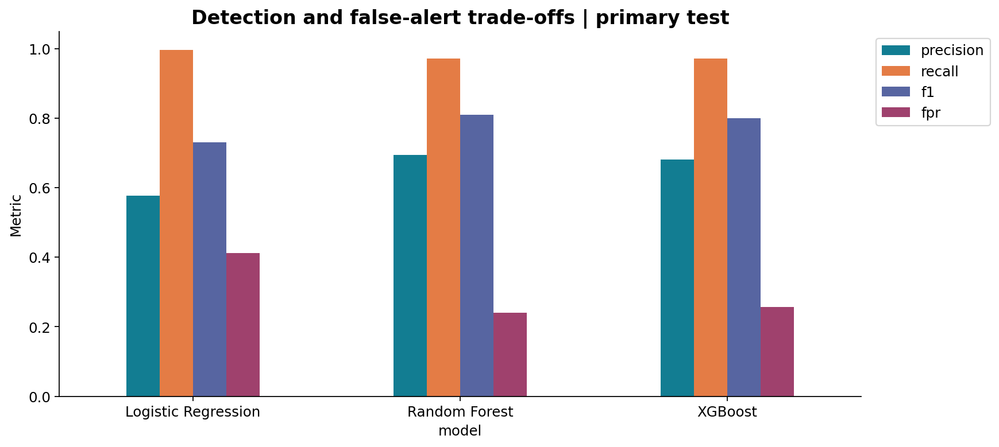

# Machine Learning-Based Network Intrusion Detection and Anomaly Classification

Graduate AI/ML capstone · UNSW-NB15 · Reproducible binary detection · Analyst review

## Executive summary
The validation-selected model is **XGBoost**, with operating threshold **0.49**.
On the primary test set of **52,738 flows**, attack recall is **97.20%**, precision **68.07%**, F1 **0.8007**, ROC-AUC **0.9698**, and average precision **0.9550**.
The model misses **532 attacks** (FNR **2.80%**) and flags **8,655 benign flows** (FPR **25.64%**).
These are historical benchmark results, not measured production effectiveness.

## Problem statement
Prioritize network-flow investigation while quantifying missed attacks and false-alert workload. The research asks whether supervised classifiers can distinguish benign and malicious flows. The primary target is `label`; `attack_cat` is reserved for operational subgroup auditing. This project does not demonstrate novel-attack discovery or multiclass anomaly classification.

## Dataset
[UNSW-NB15 official source](https://research.unsw.edu.au/projects/unsw-nb15-dataset). The local training/test partitions contain 175,341/82,332 rows before cleaning. The university download redirected to sign-in, so a public mirror was used. Its reversed filenames are normalized by row count; `reports/data_provenance.json` records exact URLs and SHA-256 hashes. Official checksum equivalence is not established. See [dataset documentation](reports/dataset_documentation.md), [dictionary](reports/data_dictionary.csv), and [download instructions](data/raw/README.md).

## Architecture and workflow



## Installation
Python 3.13; tested interpreter and library versions are recorded in `models/metadata.json`. Create an isolated environment from the repository root:

```powershell
python -m venv .venv
.\.venv\Scripts\python.exe -m pip install -r requirements-lock.txt
```

On Linux/macOS use `.venv/bin/python` in place of the Windows interpreter path. `requirements.txt` pins direct dependencies; `requirements-lock.txt` records the executed full dependency set. Alternatively use `conda env create -f environment.yml`. Deterministic seeds reduce variation; hardware and parallel floating-point behavior can still vary.

## Usage and reproduction
Run from the repository root. The download helper needs internet access and preserves the same dataset; it does not substitute another dataset.

```powershell
.\.venv\Scripts\python.exe scripts/download_data.py
.\.venv\Scripts\python.exe -m src.train
.\.venv\Scripts\python.exe scripts/execute_notebooks.py
.\.venv\Scripts\python.exe -m pytest
.\.venv\Scripts\python.exe -m streamlit run app/streamlit_app.py
```

`python -m src.train --iterations 4 --search-rows 30000` is the default experiment. Three-fold CV tunes on a fixed stratified training subset; refit uses all development training rows. All fitted model files and processed splits are regenerated. `python -m src.reporting` regenerates charts, SHAP, reports and notebooks from saved models without retraining. Notebook execution reads the saved experiment and performs additional checks; it does not repeat expensive searches. Training itself is executed by `src.train`.

## Model comparison
Validation selects the model by average precision and determines its operating threshold. Final-test outcomes do not change that choice. Primary test data exclude exact duplicate/conflicting signatures and development overlaps; secondary full-published-test results are separate.

| model               |   accuracy |   precision |   recall |     f1 |   roc_auc |   pr_auc |    fpr |    fnr |
|:--------------------|-----------:|------------:|---------:|-------:|----------:|---------:|-------:|-------:|
| Logistic Regression |     0.7358 |      0.5769 |   0.9975 | 0.7311 |    0.9089 |   0.8630 | 0.4113 | 0.0025 |
| Random Forest       |     0.8354 |      0.6938 |   0.9713 | 0.8094 |    0.9678 |   0.9506 | 0.2411 | 0.0287 |
| XGBoost             |     0.8258 |      0.6807 |   0.9720 | 0.8007 |    0.9698 |   0.9550 | 0.2564 | 0.0280 |

`pr_auc` is average precision. All rates refer to attack=1. Undefined subgroup metrics remain NaN. The comparison uses each model's validation-selected threshold; a 0.50 comparison is also supplied.

## Main findings and explainability
The selected model is XGBoost at threshold 0.49. F1 >= 0.90 achieved: False; ROC-AUC >= 0.95 achieved: True. Inspect the [evaluation report](reports/Model_Evaluation_Report.md) for error counts and threshold-constraint attainment.



Tree SHAP provides global importance, a beeswarm and local explanations for correct attacks, correct benign flows, false positives and false negatives. See [explainability](reports/Explainability_Report.md). Attributions are model associations; correlated features and environment proxies limit interpretation.

## Ethical AI and operational bias
Protocol, service, state and attack category are legitimate operational groups. The dataset lacks protected demographic attributes, so no demographic fairness conclusion is made. The [audit](reports/Bias_Fairness_Analysis.md) reports sample counts, errors and recall uncertainty. Keep analysts in the loop, minimize telemetry exposure and respect dataset terms. [Generative AI usage](reports/Generative_AI_Usage.md) distinguishes AI assistance from executed experimental evidence.

## Limitations
Historical laboratory collection, possible topology shortcuts, rare-category uncertainty, uncalibrated probabilities, bounded tuning and no temporal/cross-network holdout limit deployment claims. Exact deduplication does not eliminate shared-session or near-duplicate dependence. Aggregate context features need matching causal extraction. The mirror cannot be authenticated against official checksums. Benchmark prevalence differs from real SOC traffic.

## Repository structure

```text
app/             Streamlit demo and example flow CSV
data/raw/        Downloaded partitions (ignored by Git)
data/processed/  Reproducible fixed splits (ignored by Git)
src/             Validation, features, pipelines, training, evaluation, reporting
notebooks/       Six executed research notebooks
models/          Three models, final model and metadata (binaries ignored)
figures/         EDA, evaluation and SHAP PNGs
reports/         Narrative reports, computed tables, provenance and rubric audit
presentations/   Technical (12 slides) and executive (10 slides) content with notes
demo/            Narrated capstone demonstration video and transcript
scripts/         Download and notebook execution helpers
tests/           Pipeline, feature, prediction and metric tests
```

## Submission-ready artifacts

- `reports/Final_Project_Report.pdf` and `.docx` — polished academic report with figures, references, AI disclosure, and rubric evidence map.
- `presentations/Technical_Presentation.pptx` — 12-slide technical deck with speaker notes.
- `presentations/Executive_Presentation.pptx` — 10-slide business/executive deck with speaker notes.
- `demo/Arne_B_Ramos_Pillar_5_Capstone_Project_Demo.mp4` — narrated demonstration video covering the end-to-end project and Generative AI disclosure.
- `reports/Generative_AI_Usage.md` — detailed AI-use disclosure with verified code examples.
- `reports/Defense_QA_Cheat_Sheet.pdf` — oral-defense preparation and key numbers.

## Deployment instructions
Run Streamlit locally using the command above. Edit an example or upload a CSV containing the full 42-feature schema; label and identifiers are not needed. The app displays Benign/Attack, an uncalibrated attack score, threshold and interpretation. Use only trusted locally generated joblib artifacts. Missing model/data files receive an actionable message. This model is an educational/research prototype and should not be used as a standalone production intrusion-detection system.

A production proposal would require a matching feature extractor, privacy controls, authentication, calibration, recent independent evaluation, monitoring and rollback. No public hosting or automatic blocking has been configured.

## Reproducibility and verification
Seed 42; fixed published partition mapping; duplicate manifest; input SHA-256 hashes; pinned dependencies; saved CV configurations; persisted preprocessing/model/threshold; full test predictions and subgroup counts. See [verification](reports/Verification.md) and [rubric audit](reports/Rubric_Audit.md). Raw data and model binaries are intentionally excluded from Git because of size and data terms; regenerate them with the commands above. Project repository: [iamkenichi/AI_Capstone_Network_Intrusion_Detection](https://github.com/iamkenichi/AI_Capstone_Network_Intrusion_Detection). The original repository history is preserved.

## License and references
MIT applies only to original repository code and documentation. UNSW-NB15 remains under its authors' academic-use terms. This does not grant commercial dataset rights. See [references](reports/References.md) and the official dataset page for the requested dataset citations.
